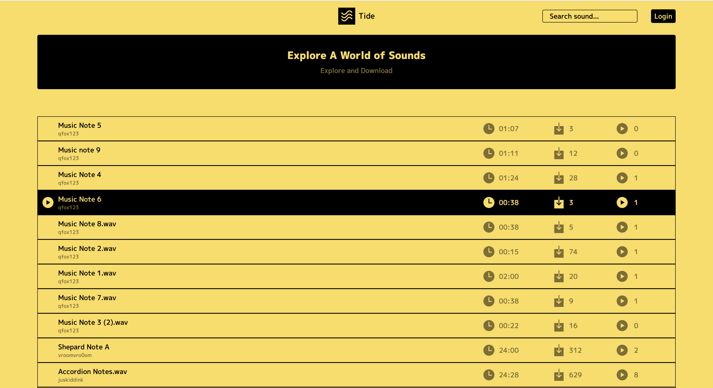

# tide

[](https://github.com/amilajack/tide/actions?query=workflow%3ATest)

## UI 

### Day Theme
#### Home Page


#### Sound Page 


## Related Repositories

* [`freesound-client`](https://github.com/amilajack/freesound-client)
* [`react-wavesurfer.js`](https://github.com/amilajack/react-wavesurfer.js)

## Setup

```bash
git clone https://github.com/amilajack/tide
cd tide
yarn
yarn start

# Run storybook on your local machine
yarn storybook
# Deploy storybook to github pages
yarn deploy-storybook

# E2E Tests
yarn start
# Run this in a separate terminal
yarn cypress open
```
