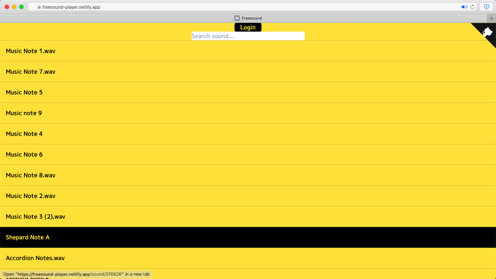
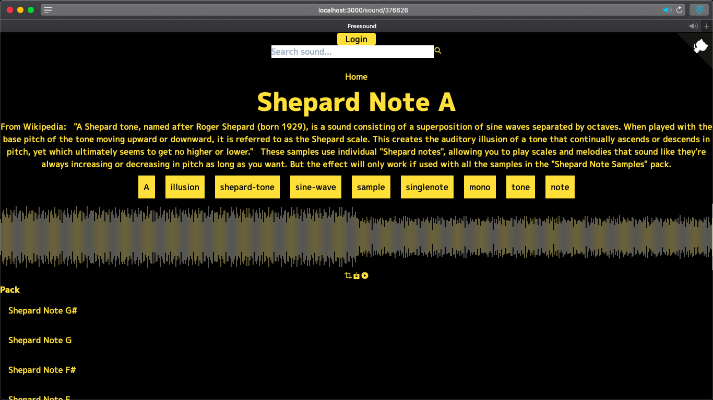

# freeesound-player

[](https://github.com/amilajack/freesound-player/actions?query=workflow%3ATest)

## Homepage



## After Selecting Sound



## Related Repositories

* [`freesound-client`](https://github.com/amilajack/freesound-client)
* [`react-wavesurfer.js`](https://github.com/amilajack/react-wavesurfer.js)

## Setup

```bash
git clone https://github.com/amilajack/freesound-player
cd freesound-player
yarn
yarn start
```
